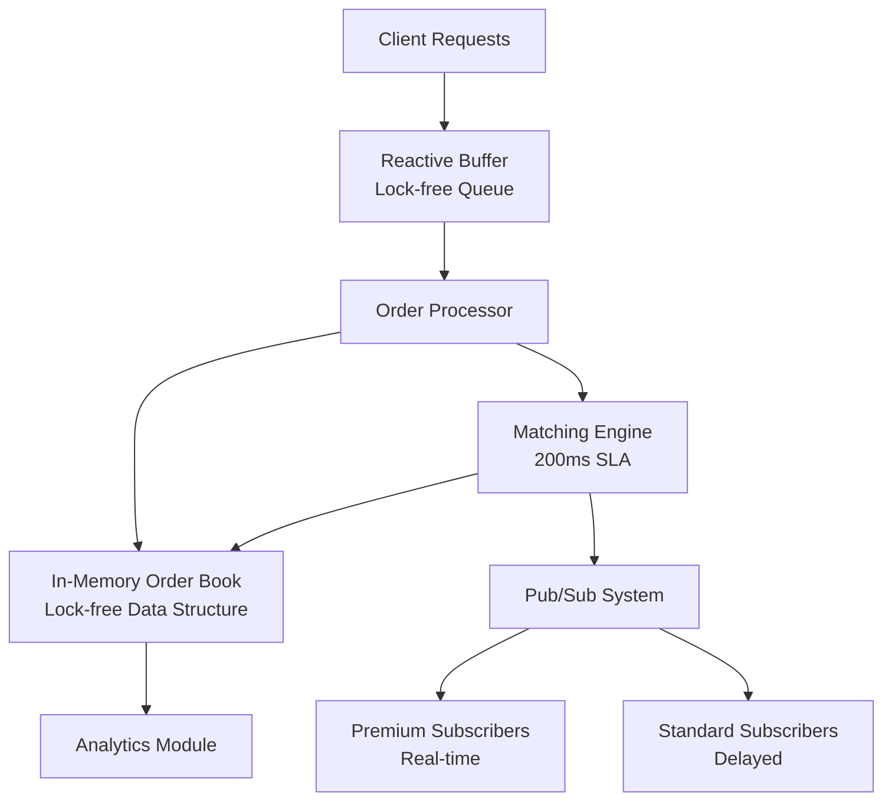

# Matching Engine Development Plan

## Architecture Overview

The system follows an LMAX-inspired architecture with lock-free data structures and reactive buffering to meet strict latency requirements (< 0.3-0.5s ingestion, < 200ms matching).



## Project Structure

```
mengine/
├── build.gradle
├── settings.gradle
├── src/
│   ├── main/java/com/mengine/
│   │   ├── Main.java                    # Application entry point
│   │   ├── config/
│   │   │   └── EngineConfig.java        # Configuration (buffer sizes, timeouts)
│   │   ├── model/
│   │   │   ├── Order.java               # Order entity (price, quantity, symbol, type)
│   │   │   ├── OrderType.java           # BUY/SELL enum
│   │   │   ├── OrderStatus.java         # PENDING/MATCHED/PARTIAL/CANCELLED
│   │   │   └── Trade.java               # Executed trade record
│   │   ├── orderbook/
│   │   │   ├── OrderBook.java           # In-memory order book per symbol
│   │   │   └── PriceLevel.java          # Price-time priority levels
│   │   ├── buffer/
│   │   │   ├── ReactiveBuffer.java      # Lock-free queue interface
│   │   │   └── DisruptorBuffer.java     # LMAX Disruptor implementation
│   │   ├── matching/
│   │   │   ├── MatchingEngine.java      # Core matching algorithm
│   │   │   └── MatchResult.java         # Match outcome (full/partial/no match)
│   │   ├── notification/
│   │   │   ├── EventPublisher.java      # Pub/Sub interface
│   │   │   ├── EventSubscriber.java     # Subscriber interface
│   │   │   ├── NotificationService.java # Premium/Standard delivery logic
│   │   │   └── Event.java               # Order/Trade events
│   │   ├── analytics/
│   │   │   └── AnalyticsModule.java     # Historical data analysis
│   │   └── api/
│   │       ├── OrderController.java     # REST endpoints
│   │       └── Server.java              # Embedded HTTP server (Jetty/Grizzly)
│   └── test/java/com/mengine/
│       ├── MatchingEngineTest.java
│       ├── OrderBookTest.java
│       ├── ReactiveBufferTest.java
│       └── LoadTest.java                # JMeter-compatible test scenarios
```

## Implementation Phases

### Phase 1: Core Entities and Order Book

**Files:**

- `src/main/java/com/mengine/model/Order.java` - Immutable order entity with price, quantity, symbol, timestamp
- `src/main/java/com/mengine/orderbook/OrderBook.java` - Lock-free order book using ConcurrentSkipListMap for price-time priority
- `src/main/java/com/mengine/orderbook/PriceLevel.java` - Price level with FIFO queue for orders at same price

**Key Design Decisions:**

- Use `ConcurrentSkipListMap<BigDecimal, PriceLevel>` for O(log n) price lookup
- Each PriceLevel maintains a lock-free queue (ConcurrentLinkedQueue) for FIFO ordering
- Orders stored with nanosecond timestamps for precise ordering
- Thread-safe without explicit locks using atomic operations

### Phase 2: Reactive Buffer

**Files:**

- `src/main/java/com/mengine/buffer/ReactiveBuffer.java` - Interface for lock-free queue
- `src/main/java/com/mengine/buffer/DisruptorBuffer.java` - LMAX Disruptor implementation

**Key Design Decisions:**

- Use LMAX Disruptor library for ultra-low latency ring buffer
- Ring buffer size: 2^16 (65536) to handle bursts
- Single producer (REST endpoint) → multiple consumers (matching threads)
- Backpressure handling: reject orders when buffer full (return 503)

### Phase 3: Matching Engine

**Files:**

- `src/main/java/com/mengine/matching/MatchingEngine.java` - Core matching algorithm
- `src/main/java/com/mengine/matching/MatchResult.java` - Match outcome with partial fills

**Matching Algorithm:**

1. For BUY order: scan SELL orders from lowest price up (best ask)
2. For SELL order: scan BUY orders from highest price down (best bid)
3. Match when: price compatible (buy.price >= sell.price)
4. Handle partial fills: update order quantities, create Trade records
5. Timeout after 200ms, return partial matches if any

**Performance:**

- Use binary search on price levels for O(log n) lookup
- Early exit when no compatible prices found
- Batch processing of multiple orders when possible

### Phase 4: Notification Service

**Files:**

- `src/main/java/com/mengine/notification/EventPublisher.java` - Publish events
- `src/main/java/com/mengine/notification/NotificationService.java` - Premium/Standard delivery
- `src/main/java/com/mengine/notification/Event.java` - Order/Trade events

**Design:**

- Premium subscribers: immediate delivery via lock-free queue
- Standard subscribers: delayed delivery (configurable, e.g., 1s batch)
- Use separate threads for each subscription tier
- Event types: ORDER_PLACED, ORDER_MATCHED, ORDER_PARTIAL, TRADE_EXECUTED

### Phase 5: REST API and Server

**Files:**

- `src/main/java/com/mengine/api/OrderController.java` - REST endpoints
- `src/main/java/com/mengine/api/Server.java` - Embedded HTTP server

**Endpoints:**

- `POST /orders` - Submit order (BUY/SELL)
- `GET /orders/{id}` - Get order status
- `GET /orderbook/{symbol}` - Get order book for symbol
- `GET /trades/{symbol}` - Get recent trades
- `POST /subscribe` - Subscribe to events (premium/standard)

**Server:**

- Use Grizzly or Jetty embedded server
- Async request handling to avoid blocking
- JSON request/response using Jackson

### Phase 6: Analytics Module

**Files:**

- `src/main/java/com/mengine/analytics/AnalyticsModule.java` - Historical analysis

**Features:**

- Trade volume by symbol/time
- Price statistics (high/low/avg)
- Order fill rates
- Latency metrics

## Dependencies (build.gradle)

```groovy
dependencies {
    // LMAX Disruptor for lock-free queue
    implementation 'com.lmax:disruptor:3.4.4'
    
    // HTTP server
    implementation 'org.glassfish.grizzly:grizzly-http-server:4.0.0'
    
    // JSON processing
    implementation 'com.fasterxml.jackson.core:jackson-databind:2.15.2'
    
    // Testing
    testImplementation 'junit:junit:4.13.2'
    testImplementation 'org.mockito:mockito-core:5.3.1'
}
```

## Performance Optimizations

1. **Memory Management:**

   - Pre-allocate objects in Disruptor ring buffer
   - Use object pooling for frequently created objects (Trade, Event)
   - Avoid GC pressure with direct memory where possible

2. **CPU Optimization:**

   - Pin critical threads to CPU cores (affinity)
   - Use `-XX:+UseG1GC` or `-XX:+UseZGC` for low-latency GC
   - Profile with JProfiler/AsyncProfiler to identify hotspots

3. **Lock-Free Algorithms:**

   - OrderBook: ConcurrentSkipListMap (lock-free reads)
   - PriceLevel queues: ConcurrentLinkedQueue
   - Event publishing: Disruptor (lock-free)

## Testing Strategy

1. **Unit Tests:** Core matching logic, order book operations
2. **Integration Tests:** End-to-end order flow
3. **Load Tests:** JMeter scripts for 1,300 orders/min baseline, 5,000 matches/min peak
4. **Latency Tests:** Measure ingestion and matching times under load

## Configuration

Environment variables or config file for:

- Buffer size
- Matching timeout (200ms)
- Premium/Standard delay thresholds
- Thread pool sizes
- Server port

## Development Prompts for Cursor Agent

1. **"Create the Order entity class with price, quantity, symbol, type, status, and timestamp fields. Make it immutable and thread-safe."**

2. **"Implement OrderBook using ConcurrentSkipListMap for price levels. Each price level should maintain a FIFO queue of orders. Support add, remove, and best bid/ask queries."**

3. **"Create a ReactiveBuffer interface and DisruptorBuffer implementation using LMAX Disruptor. Configure ring buffer size 65536 with single producer, multiple consumer pattern."**

4. **"Implement MatchingEngine with price-time priority matching. For BUY orders, match against lowest SELL prices first. Handle partial fills and return results within 200ms timeout."**

5. **"Create NotificationService with premium (real-time) and standard (delayed) subscription tiers. Use separate threads for each tier and publish Order and Trade events."**

6. **"Build REST API with Grizzly server. Create POST /orders endpoint that accepts JSON orders, validates them, and enqueues to ReactiveBuffer. Return order ID immediately."**

7. **"Add GET /orderbook/{symbol} endpoint that returns current order book state (bids and asks) in JSON format without blocking the matching engine."**

8. **"Implement AnalyticsModule that tracks trade volume, price statistics, and fill rates. Store data in-memory with configurable retention period."**

9. **"Create load test using JMeter-compatible scenarios. Test 1,300 orders/min baseline and verify < 0.5s ingestion latency. Test peak load of 5,000 matches/min."**

10. **"Add configuration management for buffer sizes, timeouts, and thread pools. Support environment variables and config file with sensible defaults for M1 Pro hardware."**